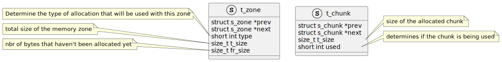

= Malloc
:toc:

My own implementation of the famous malloc(3) function.

== Resume

The purpose of the malloc function as explained by the manual is to allocate a certain amount of memory. +
The main issue is that we need to keep performances and efficiency in mind. +
We have to preallocate memory for smaller  request in advance as to limit the strain that anonymous mapping requires. +
But we also have to limit those preallocation so as to use as little memory as possible.

== Goals

. Recreate the malloc(3), free(3) and realloc(3) functions.
. Create a function that will present a visual representation of the different memory zones and their state.
. Make sure that every meme zones is aligned following the page size.
. Provide support for debugging options that would be set with environmental variables.
. Make the memory allocation thread safe so that it can be used in a multi-threaded program.
. Provide a function that will show an historic of memory allocations.
. Provide a function that will show an hexdump of the allocated zones, similar to address sanitizer.
. Defragment the memory zone when freed.

== Current features

. Basic memory allocation and deallocation.
. Basic error management.
. Basic implementation of the algorithm to manage the requested memory blocks.

== Implementation

Currently I've created a sort of chained list that I represent under the form of a global variable. +
It allows me to determine exactly which chunk of memory is being freed and what is it's size.
Below you can find a diagram that would illustrate its shape if it was a class.

A broader definition of how malloc works is showed below. Basically the user receives only +
a part of the struct chunk as the metadata is contained before the Data, when the Chunk is +
being freed the struct is being recomposed from the bytes contained before the pointer. +
The free function can then defragment the chunk and reassign it back to the free space of +
the zone.

== Lexic
Memory zone:: Also called regions, are ranges of addresses claimed by mmap(2).
Anonymous mapping:: Maps an area of the process's virtual memory not backed by any file. +
The contents are initialized to zero.
Shared mapping:: If the mapping is shared, then it is preserved when a process is forked (using a fork(2) system call). +
Therefore, writes to a mapped area in one process are immediately visible in all related (parent, child or sibling) processes. +
Memory Fragmenting:: Splitting a region of virtual memory into smaller blocks. For example, +
                    if I had a region that is 20 bytes long I could fragment it into 2 zones of 10 bytes.
Memory Defragmenting:: Rejoining two different freed memory block from the same region into one. +
                        For example I could defragment two block of 10 bytes into one of 20 bytes.

